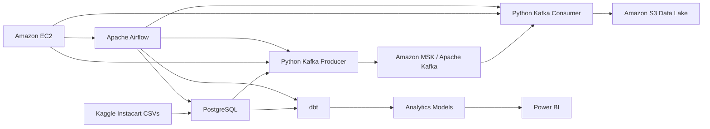

# Instacart Market Basket Data Engineering Pipeline

An end-to-end retail data engineering project built with the Kaggle **Instacart Market Basket Analysis** dataset. The pipeline demonstrates relational ingestion, event streaming, AWS infrastructure, cloud storage, analytics engineering, orchestration, and business intelligence.

## Architecture



## Technology Stack

| Technology | Purpose |
|---|---|
| PostgreSQL | Relational ingestion, validation, and source storage |
| Python | Kafka producers, consumers, and pipeline logic |
| Apache Kafka / Amazon MSK | Event streaming |
| Amazon EC2 | Compute for pipeline services and orchestration |
| Amazon S3 | Raw and processed data lake storage |
| dbt | SQL transformations, dimensional modeling, tests, and documentation |
| Apache Airflow | Workflow orchestration and scheduling |
| Power BI | Business intelligence and visualization |
| Git / GitHub | Version control and project documentation |

## Dataset

The source data is the Kaggle Instacart Market Basket Analysis dataset, including:

- `orders`
- `order_products__prior`
- `order_products__train`
- `products`
- `aisles`
- `departments`

The data captures customer orders, product selections, cart position, reorder behavior, aisles, and departments.

## Pipeline Workflow

### 1. PostgreSQL ingestion and validation

The source CSV files are loaded into PostgreSQL and validated for:

- duplicate keys
- null identifiers
- invalid relationships
- unexpected values
- data type consistency

PostgreSQL acts as the structured system of record for the source dataset.

### 2. Kafka event streaming

Historical orders are replayed as events to simulate a live retail ordering system.

Example event:

```json
{
  "order_id": 2539329,
  "user_id": 1,
  "order_number": 1,
  "order_dow": 2,
  "order_hour_of_day": 8
}
```

Primary topics:

```text
instacart.orders
instacart.order_products
```

A Python producer publishes PostgreSQL records to Kafka, while a Python consumer processes the events downstream.

### 3. Amazon MSK and EC2

Amazon MSK provides managed Kafka broker infrastructure. Amazon EC2 is used as the compute environment for pipeline services such as:

- Kafka producer
- Kafka consumer
- Apache Airflow
- supporting Python jobs

### 4. Amazon S3 data lake

Kafka consumer output is persisted to Amazon S3 using a layered layout such as:

```text
s3://instacart-market-pipeline/
├── raw/
│   ├── orders/
│   └── order_products/
├── processed/
└── archive/
```

Processed datasets can be stored in Parquet for efficient downstream analytics.

### 5. dbt analytics engineering

dbt transforms relational source tables into analytics-ready models.

```text
models/
├── staging/
│   ├── stg_orders.sql
│   ├── stg_products.sql
│   ├── stg_order_products.sql
│   ├── stg_departments.sql
│   └── stg_aisles.sql
├── marts/
│   ├── fact_orders.sql
│   ├── fact_order_products.sql
│   ├── dim_products.sql
│   ├── dim_departments.sql
│   └── dim_aisles.sql
└── analytics/
    ├── customer_purchase_summary.sql
    ├── product_performance.sql
    ├── reorder_analysis.sql
    └── basket_analysis.sql
```

Data quality tests cover uniqueness, nullability, relationships, and accepted values.

### 6. Apache Airflow orchestration

Airflow coordinates the pipeline in dependency order:

```text
Validate PostgreSQL
        ↓
Run Kafka Producer
        ↓
Consume Kafka Events
        ↓
Write to S3
        ↓
Run dbt Models
        ↓
Run dbt Tests
        ↓
Refresh Analytics Layer
        ↓
Complete
```

### 7. Power BI analytics

Power BI consumes curated analytics models for dashboards covering:

- top products
- reorder rates
- basket size
- customer purchase frequency
- department and aisle performance
- shopping behavior by day and hour
- frequently purchased product combinations

## Repository Structure

```text
instacart-market-basket-pipeline/
├── README.md
├── requirements.txt
├── .gitignore
├── sql/
├── kafka/
├── dbt/
├── airflow/
├── aws/
├── powerbi/
└── docs/
```

## Engineering Concepts Demonstrated

- ETL / ELT pipeline design
- relational database modeling
- SQL data validation
- event-driven architecture
- Kafka producers and consumers
- Amazon MSK
- Amazon EC2
- Amazon S3 data lake design
- dbt dimensional modeling
- automated data quality testing
- Apache Airflow orchestration
- Power BI reporting
- Python pipeline development

## Project Objective

The objective of this project is to demonstrate how a large retail transaction dataset can move through a modern data platform from ingestion to analytics. The design combines batch data, event streaming, cloud infrastructure, transformation, orchestration, and BI into one reproducible data-engineering workflow.
