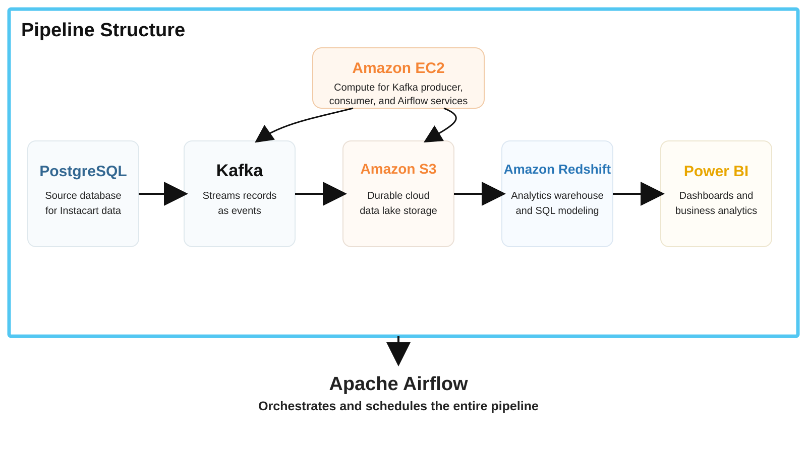

# Instacart Market Basket Data Engineering Pipeline

An end-to-end data engineering and analytics pipeline built with the Kaggle **Instacart Market Basket Analysis** dataset.

The project demonstrates how a large relational dataset can move from a transactional database through an event-streaming layer and AWS cloud infrastructure into a data warehouse for business intelligence.

## Final Architecture



### Data Flow

```text
Instacart CSVs
      ↓
PostgreSQL
      ↓
Apache Kafka
      ↓
Amazon EC2 compute
      ↓
Amazon S3
      ↓
Amazon Redshift
      ↓
Power BI

Apache Airflow orchestrates and schedules the entire pipeline.
```

## How the Pipeline Works


## Technology Stack

| Technology | Role in the pipeline |
|---|---|
| PostgreSQL | Initial relational source database for the Instacart dataset |
| Apache Kafka | Streams PostgreSQL records as events |
| Python | Implements Kafka producer/consumer and supporting pipeline logic |
| Amazon EC2 | Compute environment for Kafka producer/consumer processes and Airflow services |
| Amazon S3 | Durable cloud data lake for streamed raw and processed data |
| Amazon Redshift | Analytics data warehouse used to load, transform, organize, and query S3 data |
| Power BI | Business intelligence dashboards and analytics connected to Redshift |
| Apache Airflow | Schedules, monitors, retries, and orchestrates the entire workflow |
| Git / GitHub | Version control and project documentation |

## Dataset

The source is the Kaggle **Instacart Market Basket Analysis** dataset.

Primary source tables include:

- `orders`
- `order_products__prior`
- `order_products__train`
- `products`
- `aisles`
- `departments`

The data captures customer orders, products, cart position, reorder behavior, aisles, departments, shopping day, and shopping hour.

## Pipeline Stages

### 1. PostgreSQL — source database

The original Instacart CSV files are loaded into PostgreSQL.

PostgreSQL preserves the relational structure of the dataset and provides the source records consumed by the streaming pipeline.

Data validation includes checks for:

- duplicate identifiers
- null keys
- invalid joins
- unexpected values
- data type consistency

Example:

```sql
SELECT order_id, COUNT(*)
FROM orders
GROUP BY order_id
HAVING COUNT(*) > 1;
```

### 2. Apache Kafka — streaming layer

A Python Kafka producer reads records from PostgreSQL and publishes them as events.

Example order event:

```json
{
  "order_id": 2539329,
  "user_id": 1,
  "order_number": 1,
  "order_dow": 2,
  "order_hour_of_day": 8
}
```

Example topics:

```text
instacart.orders
instacart.order_products
```

A Kafka consumer processes the events and sends the data downstream to Amazon S3.

### 3. Amazon EC2 — compute layer

Amazon EC2 supplies the compute environment behind the pipeline.

The EC2 instance is used to run:

- Python Kafka producer
- Python Kafka consumer
- Apache Airflow services
- supporting ingestion and AWS integration scripts

EC2 is not the data-streaming technology itself; it provides the compute resources on which the pipeline processes run.

### 4. Amazon S3 — data lake

Kafka consumer output is persisted to Amazon S3.

Example layout:

```text
s3://instacart-market-pipeline/
├── raw/
│   ├── orders/
│   └── order_products/
├── processed/
└── archive/
```

S3 provides durable and scalable storage between the streaming layer and the analytics warehouse.

### 5. Amazon Redshift — analytics warehouse

Data stored in S3 is loaded into Amazon Redshift.

Redshift is responsible for the analytics layer of the project:

- loading data from S3
- running transformation SQL
- organizing analytics-ready tables
- creating aggregations
- supporting high-volume analytical queries
- serving data to Power BI

Example analytical outputs include:

- product performance
- reorder behavior
- average basket size
- department and aisle performance
- customer purchasing patterns
- frequently purchased product combinations

### 6. Power BI — business intelligence

Power BI connects to Amazon Redshift and visualizes the analytics-ready datasets.

Dashboard areas can include:

- most purchased products
- highest reorder rates
- average basket size
- order frequency
- department performance
- aisle performance
- orders by day of week
- orders by hour
- market basket relationships

## Apache Airflow — orchestration layer

Apache Airflow sits across the complete pipeline rather than acting as another storage or transformation step.

Airflow coordinates execution in dependency order:

```text
Start
  ↓
Validate PostgreSQL source
  ↓
Run Kafka producer
  ↓
Consume Kafka events
  ↓
Write data to Amazon S3
  ↓
Load S3 data into Redshift
  ↓
Run Redshift transformation SQL
  ↓
Validate analytics tables
  ↓
Trigger / prepare Power BI refresh
  ↓
Complete
```

Airflow provides:

- scheduling
- task dependencies
- retries
- logging
- monitoring
- failure handling
- automated pipeline execution

## Repository Structure

```text
instacart-market-basket-pipeline/
├── README.md
├── requirements.txt
├── .gitignore
│
├── sql/
│   └── validation.sql
│
├── kafka/
│   ├── producer.py
│   └── consumer.py
│
├── airflow/
│   └── dags/
│       └── instacart_pipeline.py
│
├── aws/
│   ├── ec2/
│   ├── s3/
│   └── redshift/
│
├── powerbi/
│
└── docs/
    └── architecture/
        ├── pipeline-structure.svg
        └── pipeline-components.svg
```

## Engineering Concepts Demonstrated

- relational data ingestion
- SQL data validation
- event-driven architecture
- Apache Kafka producers and consumers
- Python data pipeline development
- AWS EC2 compute
- Amazon S3 data lake design
- Amazon Redshift data warehousing
- analytical SQL transformations
- Apache Airflow orchestration
- automated workflow scheduling
- pipeline monitoring and retry handling
- Power BI reporting
- end-to-end cloud data pipeline design

## Project Objective

The objective of this project is to demonstrate how transactional retail data can be moved through a modern data engineering architecture from relational ingestion to event streaming, cloud storage, data warehousing, orchestration, and business intelligence.

The project uses **PostgreSQL → Kafka → EC2 → S3 → Redshift → Power BI**, with **Apache Airflow orchestrating the complete workflow**.
